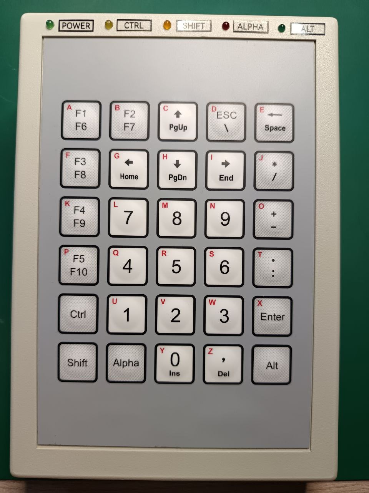
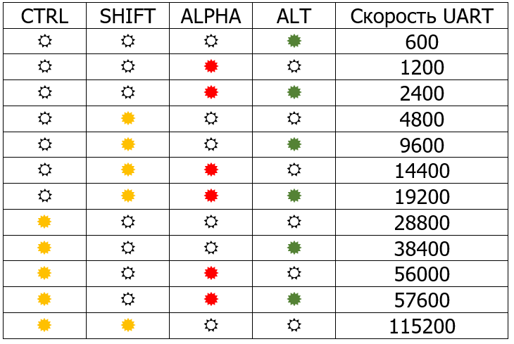
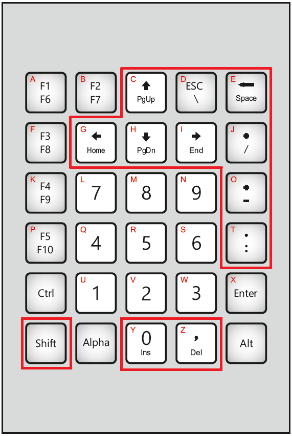
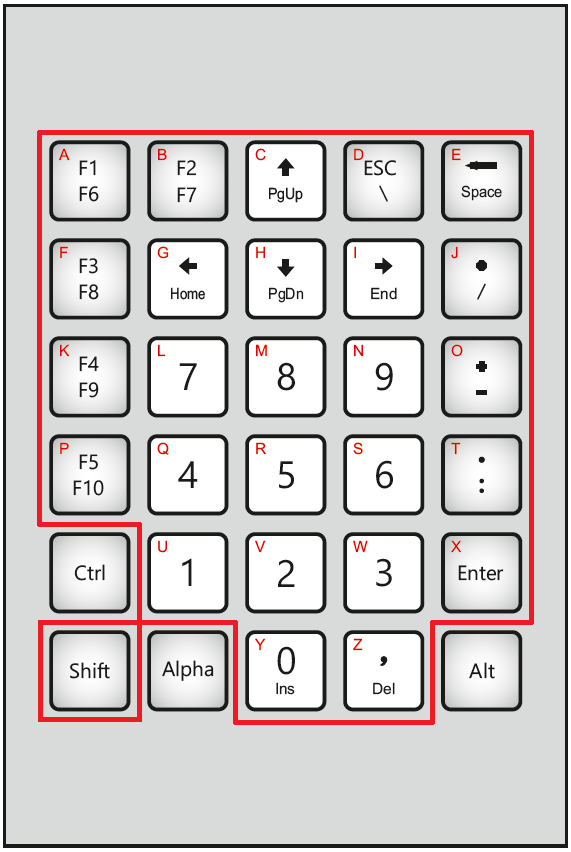
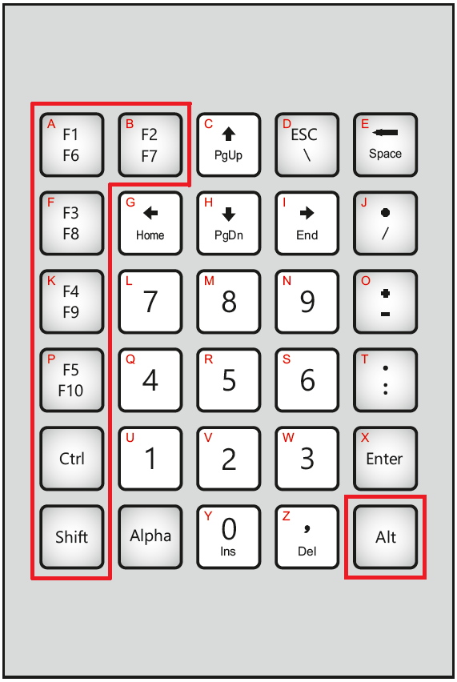
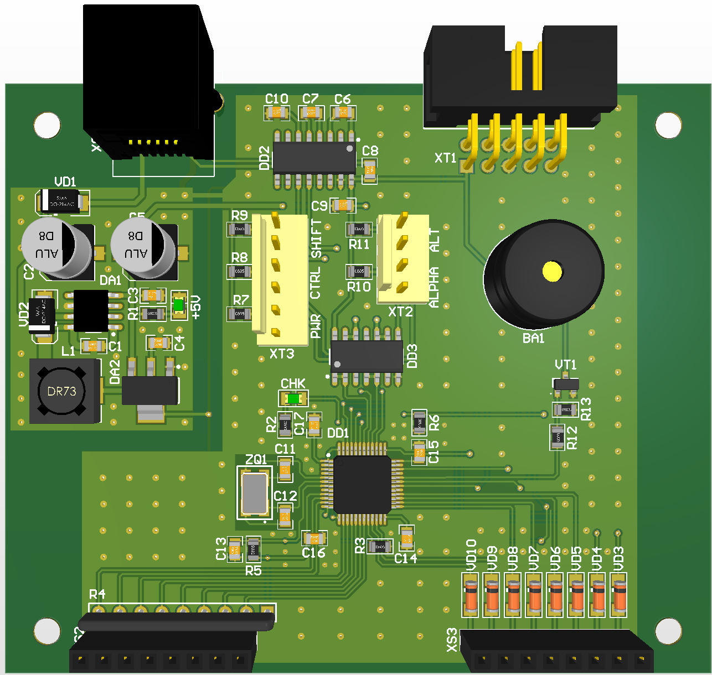

### Внешняя клавиатура для LCD терминала.
---

---

##### Описание функционала:
* Внешнее питание **9-15VDC**;
* Ввод символов: **abcdefgijklnmopqrstuvwxyz ABCDEFGIJKLNMOPQRSTUVWXYZ**;
* Ввод цифр: **0123456789**;
* Ввод знаков: **,.:+-*/\**;
* Ввод команд управления курсором;
* Передача данных выполняется по интерфейсу **RS-232**;
* Скорость передачи данных: **600 - 115200**;
* Скорость передачи данных клавиатуры может быть настроена вручную, для этого необходимо перед включением удерживать клавишу **F1**, прозвучит длинный звуковой сигнал после которого, в режиме мигания, на индикаторах *CTRL*-*SHIF*-*ALPHA*-*ALT* в двоичном коде отображается код скорости. Скорость меняется с помощью клавиш **UP**/**DOWN**, завершение ввода осуществляется клавишей **ENTER**. Выход из режима изменения скорости без сохранения осуществляется клавишей **ESC**;
* Режим работы клавиш: **ALT**, **CTRL**, **SHIFT** - без фиксации;
* Режим работы клавиши: **ALPHA** - c фиксацией.

* Скорость передачи данных может быть изменена по интерфейсу **RS-232** с помощью команды ***UART 600-115200 [SAVE]***, дополительный параметр ***SAVE*** сохраняет значение скорости во FLASH памяти контроллера, в противном случае новое значение скорости будет действовать до момента перезагрузки контроллера;
* Возможна настройка до 20 макросов (набора текстовых команд) для функциональных клавиш ***CTRL+(SHIFT+)Fn***, ***ALT+(SHIFT+)Fn***. Настройка макросов выполняется командами ***MCTRL 1-10 "..." [SAVE]***, ***MALT 1-10 "..." [SAVE]*** от внешнего контроллера. Дополительный параметр ***SAVE*** сохраняет значение скорости во FLASH памяти контроллера, в противном случае новое значение скорости будет действовать до момента перезагрузки контроллера.

* Доступные варианты комбинаций для клавиши **SHIFT**

* Доступные варианты комбинаций для клавиши **ALPHA**

* Доступные варианты комбинаций для клавиш **Fn**

* Скорость обмена по UART отладочного порта фиксированная - 57600.

---

Схемотехника контроллера [KeyPad_sch.pdf](Doc/KeyPad_sch.pdf)

